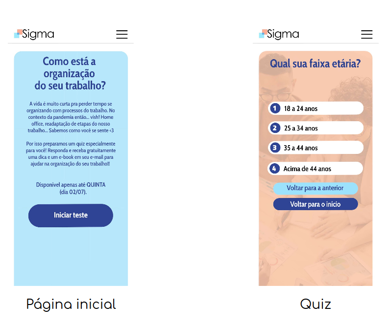
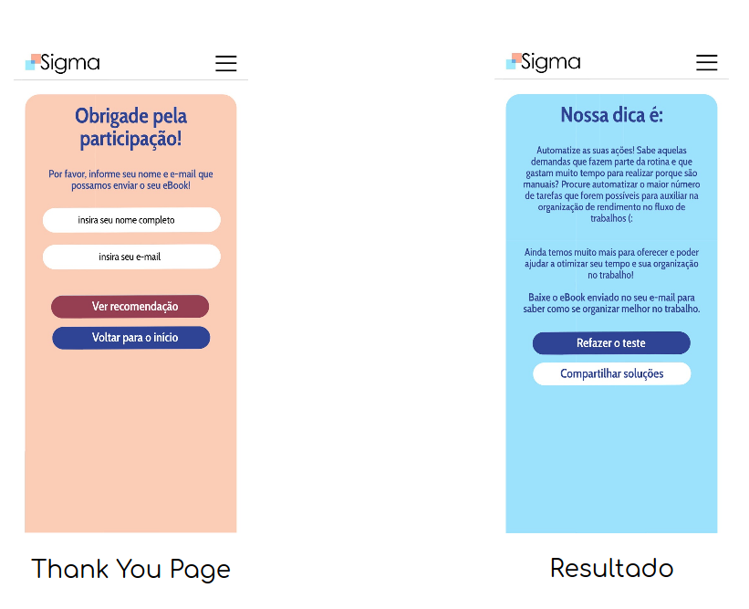

# Show me the leads

## Indice

* [1. Sobre o projeto](#1-sobre-o-projeto)
* [2. Persona](#2-persona)
* [3. Funcionalidades da aplicação](#3-funcionalidades-da-aplicação)
* [4. Protótipos](#4-prototipos)
* [5. Ferramentas utilizadas](#5-ferramentas-utilizadas)
* [6. Colaboradores](#5-colaboradores)

***

## 1. Sobre o projeto
***

Ésta é uma Landing Page desenvolvida durante o primeiro desafio do Gama Experience 34 (XP) da Gama Academy.
O objetivo foi capturar 1.000 leads para uma determinada persona.

***
## 2. A Persona
***

Pequenas, médias, grandes empresas e Micro empreendedores individuais (MEIs).

***
## 3. Funcionalidades da aplicação
***

Foi desevolvido um quiz a fim de identificar, categorizar e validar os leads captados.

* Iniciar o quiz
* Avançar e retroceder nas questões
* Input box para respostas não listadas
* Input box para captação de nome e email

***
## 4. Protótipos
***

Após receber o protótipo do layout, pensado apenas para mobile, bem como a paleta de cores foi feito o esboço das rotas. De modo complementar foi considerado a responsividade do projeto.

_Foto do layout mobile, pagina inicial e quiz_

_Foto do layout mobile, pagina de captação e de agradecimento_

***
## 5. Ferramentas utilizadas
***

Para desenvolver a aplicação, utilizamos as seguintes ferramentas:

* JavaScript
* HTML5
* CSS
* Bootstrap 4.5
* Firebase/Firestore
* GIT
* GitHub
* Visual Studio Code
* Trello
* Figma

***
## 6 - Colaboradores
***

Profissionais de diferentes areas contruibuiram para a realização do projeto.

* Front-end: 
[Gizele Rodrigues](https://www.linkedin.com/in/gizele-rodrigues-336943142/), 
[Valquiria Mascarenhas Aidar](https://www.linkedin.com/in/val-aidar/)
* Marketing Digital / Growth: 
[Maria Helena Almeida de Assunção](https://www.linkedin.com/in/mariahelenaal/), 
[Murilo de Sousa Lourenço](https://www.linkedin.com/in/murilo-de-sousa-louren%C3%A7o/)
* Inside Sales: 
[Larissa Fonseca Veloso](https://www.linkedin.com/in/larissa-veloso-1382821a0/), 
[Tatiane Mikami Costa](https://www.linkedin.com/in/tatianemikamicosta/)
* UX/UI Design: 
[Bárbara Carolina de Lima](https://www.linkedin.com/in/barbara-lima-76105045/), 
[Luciana Buglia Pires](https://www.linkedin.com/in/luciana-buglia-5b82a996/)
